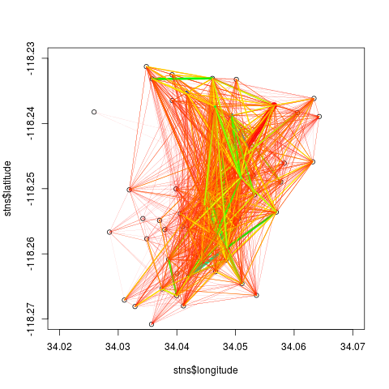
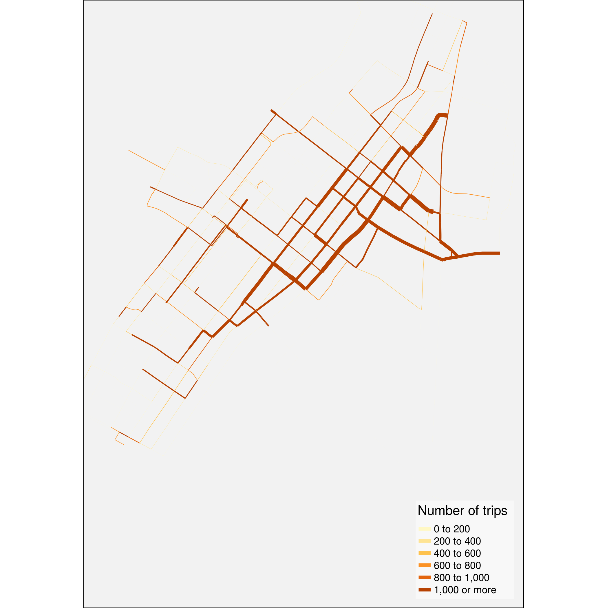

# bikedata

## 1. Introduction

`bikedata` is an R package for downloading and aggregating data from
public bicycle hire, or bike share, systems. Although there are very
many public bicycle hire systems in the world ([see this wikipedia
list](https://en.wikipedia.org/wiki/List_of_bicycle-sharing_systems)),
relatively few openly publish data on system usage. The `bikedata`
package aims to enable ready importing of data from all systems which
provide it, and will be expanded on an ongoing basis as more systems
publish open data. Cities and names of associated public bicycle hire
systems currently included in the `bikedata` package, along with numbers
of bikes and of docking stations, are:

| City | Hire Bicycle System | Number of Bicycles | Number of Docking Stations |
|----|----|----|----|
| London, U.K. | [Santander Cycles](https://tfl.gov.uk/modes/cycling/santander-cycles) | 13,600 | 839 |
| San Francisco Bay Area, U.S.A. | [Ford GoBike](https://www.fordgobike.com/) | 7,000 | 540 |
| New York City NY, U.S.A. | [citibike](https://www.citibikenyc.com/) | 7,000 | 458 |
| Chicago IL, U.S.A. | [Divvy](https://www.divvybikes.com/) | 5,837 | 576 |
| Montreal, Canada | [Bixi](https://bixi.com/) | 5,220 | 452 |
| Washingon DC, U.S.A. | [Capital BikeShare](https://www.capitalbikeshare.com/) | 4,457 | 406 |
| Guadalajara, Mexico | [mibici](https://www.mibici.net/) | 2,116 | 242 |
| Minneapolis/St Paul MN, U.S.A. | [Nice Ride](https://www.niceridemn.com/) | 1,833 | 171 |
| Boston MA, U.S.A. | [Hubway](https://www.bluebikes.com/) | 1,461 | 158 |
| Philadelphia PA, U.S.A. | [Indego](https://www.rideindego.com) | 1,000 | 105 |
| Los Angeles CA, U.S.A. | [Metro](https://bikeshare.metro.net/) | 1,000 | 65 |

All of these systems record and disseminate individual trip data,
minimally including the times and places at which every trip starts and
ends. Some provide additional anonymised individual data, typically
including whether or not a user is registered with the system and if so,
additional data including age, gender, and residential postal code. The
list of cities may be obtained with the
[`bike_cities()`](https://docs.ropensci.org/bikedata/reference/bike_cities.md)
functions, and details of which include demographic data with
[`bike_demographic_data()`](https://docs.ropensci.org/bikedata/reference/bike_demographic_data.md).

Cities with extensively developed systems and cultures of public hire
bicycles, yet which do not provide (publicly available) data include:

| City             | Number of Bicycles | Number of Docking Stations |
|------------------|--------------------|----------------------------|
| Hangzhou, China  | 78,000             | 2,965                      |
| Paris, France    | 14,500             | 1,229                      |
| Barcelona, Spain | 6,000              | 424                        |

The current version of the `bikedata` R package can be installed with
the following command:

``` r

install.packages ('bikedata')
```

Or the development version with

``` r

devtools::install_github ("mpadge/bikedata")
```

Once installed, it can be loaded in the usual way:

``` r

library (bikedata)
```

    ## Data for London, U.K. powered by TfL Open Data:
    ##   Contains OS data Ⓒ Crown copyright and database rights 2016
    ## Data for New York City provided and owned by:
    ##   NYC Bike Share, LLC and Jersey City Bike Share, LLC ("Bikeshare")
    ##   see https://www.citibikenyc.com/data-sharing-policy
    ## Data for Washington DC (Captialbikeshare), Chiago (Divvybikes) and Boston (Hubway)
    ##   provided and owned by Motivate International Inc.
    ##   see https://www.capitalbikeshare.com/data-license-agreement
    ##   and https://www.divvybikes.com/data-license-agreement
    ##   and https://www.thehubway.com/data-license-agreement
    ## Nice Ride Minnesota license  https://assets.niceridemn.com/data-license-agreement.html

## 2. Main Functions

The `bikedata` function
[`dl_bikedata()`](https://docs.ropensci.org/bikedata/reference/dl_bikedata.md)
downloads individual trip data from any or all or the above listed
systems, and the function
[`store_bikedata()`](https://docs.ropensci.org/bikedata/reference/store_bikedata.md)
stores them in an `SQLite3` database. For example, the following line
will download all data from the Metro system of Los Angeles CA, U.S.A.,
and store them in a database named ‘bikedb’,

``` r

bikedb <- file.path (tempdir (), "bikedb.sqlite") # or whatever
dl_bikedata (city = 'la', dates = 2016, quiet = TRUE)
store_bikedata (data_dir = tempdir (), bikedb = bikedb, quiet = TRUE)
```

    ## [1] 98138

The
[`store_bikedata()`](https://docs.ropensci.org/bikedata/reference/store_bikedata.md)
function returns the number of trips added to the database. Both the
downloaded data and the `SQLite3` database are stored by default in the
temporary directory of the current `R` session. Any data downloaded into
[`tempdir()`](https://rdrr.io/r/base/tempfile.html) will of course be
deleted on termination of the active **R** session; use of other
directories (as described below) will create enduring data which must be
managed by the user.

Successive calls to
[`store_bikedata()`](https://docs.ropensci.org/bikedata/reference/store_bikedata.md)
will append additional data to the same database. For example, the
following line will append all data from Chicago’s Divvy bike system
from the year 2017 to the database created with the first call above.

``` r

dl_bikedata (city = 'divvy', dates = 2016, quiet = TRUE)
store_bikedata (bikedb = bikedb, data_dir = tempdir (), quiet = TRUE)
```

    ## [1] 3595383

The function again returns the number of trips *added* to the database,
which is now less than the total number of trips stored of:

``` r

bike_db_totals (bikedb = bikedb)
```

    ## [1] 3693521

Prior to accessing any data from the `SQLite3` database, it is
recommended to create database indexes using the function
[`index_bikedata_db()`](https://docs.ropensci.org/bikedata/reference/index_bikedata_db.md):

``` r

index_bikedata_db (bikedb = bikedb)
```

This will speed up subsequent extraction of aggregated data.

Having stored individual trip data in a database, the primary function
of the `bikedata` package is
[`bike_tripmat()`](https://docs.ropensci.org/bikedata/reference/bike_tripmat.md),
which extracts aggregate numbers of trips between all pairs of stations.
The minimal arguments to this function are the name of the database, and
the name of a city for databases holding data from multiple cities.

``` r

tm <- bike_tripmat (bikedb = bikedb, city = 'la')
class (tm); dim (tm); sum (tm)
```

    ## [1] "matrix"

    ## [1] 64 64

    ## [1] 98138

In 2016, the Los Angeles Metro system had 64 docking stations, and there
were a total of 98,138 individual trips during the year. Trip matrices
can also be extracted in long form using

``` r

bike_tripmat (bikedb = bikedb, city = 'la', long = TRUE)
```

    ## # A tibble: 4,096 × 3
    ##    start_station_id end_station_id numtrips
    ##    <chr>            <chr>             <dbl>
    ##  1 la3005           la3005              252
    ##  2 la3005           la3006               93
    ##  3 la3005           la3007               23
    ##  4 la3005           la3008              153
    ##  5 la3005           la3010                5
    ##  6 la3005           la3011               63
    ##  7 la3005           la3014               40
    ##  8 la3005           la3016               10
    ##  9 la3005           la3018               31
    ## 10 la3005           la3019               36
    ## # ℹ 4,086 more rows

Details of the docking stations associated with these trip matrices can
be obtained with

``` r

bike_stations (bikedb = bikedb)
```

    ## # A tibble: 660 × 6
    ##       id city  stn_id name  longitude latitude
    ##    <int> <chr> <chr>  <chr>     <dbl>    <dbl>
    ##  1     1 la    la3005 ""         34.0    -118.
    ##  2     2 la    la3006 ""         34.0    -118.
    ##  3     3 la    la3007 ""         34.1    -118.
    ##  4     4 la    la3008 ""         34.0    -118.
    ##  5     5 la    la3009 ""         34.0    -118.
    ##  6     6 la    la3010 ""         34.0    -118.
    ##  7     7 la    la3011 ""         34.0    -118.
    ##  8     8 la    la3013 ""         34.1    -118.
    ##  9     9 la    la3014 ""         34.1    -118.
    ## 10    10 la    la3016 ""         34.0    -118.
    ## # ℹ 650 more rows

Stations can also be extracted for particular cities:

``` r

st <- bike_stations (bikedb = bikedb, city = 'ch')
```

For consistency and to avoid potential confusion of function names, most
functions in the `bikedata` package begin with the prefix `bike_`
(except for
[`store_bikedata()`](https://docs.ropensci.org/bikedata/reference/store_bikedata.md)
and
[`dl_bikedata()`](https://docs.ropensci.org/bikedata/reference/dl_bikedata.md)).

Databases generated by the `bikedata` package will generally be very
large (commonly at least several GB), and many functions may take
considerable time to execute. It is nevertheless possible to explore
package functionality quickly through using the additional helper
function,
[`bike_write_test_data()`](https://docs.ropensci.org/bikedata/reference/bike_write_test_data.md).
This function uses the `bike_dat` data set provided with the package,
which contains details of 200 representative trips for each of the
cities listed above. The function writes these data to disk as `.zip`
files which can then be read by the
[`store_bikedata()`](https://docs.ropensci.org/bikedata/reference/store_bikedata.md)
function.

``` r

bike_write_test_data ()
store_bikedata (bikedb = 'testdb')
bike_summary_stats (bikedb = 'testdb')
```

The `.zip` files generated by
[`bike_write_test_data()`](https://docs.ropensci.org/bikedata/reference/bike_write_test_data.md)
are created by default in the
[`tempdir()`](https://rdrr.io/r/base/tempfile.html) of the current `R`
session, and so will be deleted on session termination. Specifying any
alternative `bike_dir` will create enduring copies of those files in
that location which ought to be deleted when finished.

The remainder of this vignette provides further detail on these three
distinct functional aspects of downloading, storage, and extraction of
data.

## 3. Downloading Data

Data may be downloaded with the
[`dl_bikedata()`](https://docs.ropensci.org/bikedata/reference/dl_bikedata.md)
function. In it’s simplest form, this function requires specification
only of a city for which data are to be downloaded, although the
directory is usually specified as well:

``` r

dl_bikedata (city = 'chicago', data_dir = '/data/bikedata/')
```

## 3.1 Downloading data for specific date ranges

Both
[`store_bikedata()`](https://docs.ropensci.org/bikedata/reference/store_bikedata.md)
and
[`dl_bikedata()`](https://docs.ropensci.org/bikedata/reference/dl_bikedata.md)
accept an additional argument (`dates`) specifying ranges of dates for
which data should be downloaded and stored. The format of this argument
is quite flexible so that,

``` r

dl_bikedata (city = 'dc', dates = 16)
```

will download data from Washington DC’s Capital Bikeshare system for all
12 months of the year 2016, while,

``` r

dl_bikedata (city = 'ny', dates = 201604:201608)
```

will download New York City data from April to August (inclusively) for
that year. (Note that the default `data_dir` is the
[`tempdir()`](https://rdrr.io/r/base/tempfile.html) of the current `R`
session, with downloaded files being deleted upon session termination.)
Dates can also be entered as character strings, with the following calls
producing results equivalent to the preceding call,

``` r

dl_bikedata (city = 'ny', dates = '2016/04:2016/08')
dl_bikedata (city = 'new york', dates = '201604:201608')
dl_bikedata (city = 'n.y.c.', dates = '2016-04:2016-08')
dl_bikedata (city = 'new', dates = '2016 Apr-Aug')
```

The only strict requirement for the format of `dates` is that years must
be specified before months, and that some kind of separator must be used
between the two except when formatted as single six-digit numbers or
character strings (YYYYMM). The arguments `city = 'new'` and
`city = 'CI'` in the final call are sufficient to uniquely identify New
York City’s citibike system.

If files have been previously downloaded to a nominated directory, then
calling the
[`dl_bikedata()`](https://docs.ropensci.org/bikedata/reference/dl_bikedata.md)
function will only download those data files that do not already exist.
This function may thus be used to periodically refresh the contents of a
nominated directory as new data files become available.

Some systems disseminate data on quarterly (Washington DC and Los
Angeles) or bi-annual (Chicago) bases. The `dates` argument in these
cases is translated to the appropriate quarterly or bi-annual files.
These are then downloaded as single files, and thus the following call

``` r

dl_bikedata (city = 'dc', dates = '2016.03-2016.05')
```

will actually download data for the entire first and second quarters of
2016. Even though the database constructed with
[`store_bikedata()`](https://docs.ropensci.org/bikedata/reference/store_bikedata.md)
will then contain data beyond the specified date ranges, it is
nevertheless possible to obtain a trip matrix corresponding to specific
dates and/or times, as described below.

The `dates` argument can also be passed to `store_bikedata`. This is
useful in cases where data are to be loaded only from a restricted set
of files in the given data directory.

## 3.2 Refreshing data sources

The
[`dl_bikedata()`](https://docs.ropensci.org/bikedata/reference/dl_bikedata.md)
function will only download data that do not already exist in the
nominated directory, and so can be use to periodically refresh data. If,
for example, the following function were previously run at the end of
2017:

``` r

dl_bikedata (city = 'sf', data_dir = '/data/stored/here')
```

then running again in, say, April 2018, would download three additional
files corresponding to the first three months of 2018. These data can
then be added to a previously-constructed database with the usual call

``` r

store_bikedata (city = 'sf', data_dir = '/data/stored/here', bikedb = bikedb)
```

If previous data have been stored in a nominated database, yet deleted
from local storage, then any new data can be added by first getting the
names of previously stored files with

``` r
bike_stored_files (bikedb = bikedb = city = 'sf')
```

And then calling `dl_bikedata`, with `dates` specified to add only those
files not previously stored.

## 4. Storing Data

As mentioned above, individual trip data are stored in a single
`SQLite3` database, created by default in the temporary directory of the
current `R` session. Specifying a path for the `bikedb` argument in the
[`store_bikedata()`](https://docs.ropensci.org/bikedata/reference/store_bikedata.md)
function will create a database that will remain in that location until
explicitly deleted.

The nominated database is created if it does not already exist,
otherwise additional data are appended to the existing database. As
described above, the same `dates` argument can be passed to both
[`dl_bikedata()`](https://docs.ropensci.org/bikedata/reference/dl_bikedata.md)
and
[`store_bikedata()`](https://docs.ropensci.org/bikedata/reference/store_bikedata.md)
to download data within specified ranges of dates.

Both
[`dl_bikedata()`](https://docs.ropensci.org/bikedata/reference/dl_bikedata.md)
and
[`store_bikedata()`](https://docs.ropensci.org/bikedata/reference/store_bikedata.md)
are primarily intended to be used to download data for specified cities.
It is possible to use the latter to store all data for all cities simply
by calling `store_bikedata (bikedb = bikedb)`, however doing so will
request confirmation that data from *all* cities really ought to be
downloaded and/or stored. Intended general usage of the
[`store_bikedata()`](https://docs.ropensci.org/bikedata/reference/store_bikedata.md)
function is illustrated in the following line:

``` r

dl_bikedata (bikedb = bikedb, city = 'ny', dates = '2014 aug - 2015 dec')
ntrips <- store_bikedata (bikedb = bikedb, city = 'ny',
                          data_dir = '/data/stored/here')
```

Note that passing with `city` parameter to
[`store_bikedata()`](https://docs.ropensci.org/bikedata/reference/store_bikedata.md)
is not strictly necessary, but will ensure that only data for the
nominated city are loaded from directories which may contain additional
data from other cities.

## 5. Accessing Aggregate Data

### 5.1 Origin-Destination Matrices

As briefly described in the introduction, the primary function for
extracting aggregate data from the `SQLite3` database established with
[`store_bikedata()`](https://docs.ropensci.org/bikedata/reference/store_bikedata.md)
is
[`bike_tripmat()`](https://docs.ropensci.org/bikedata/reference/bike_tripmat.md).
With the single mandatory argument naming the database, this function
returns a matrix of numbers of trips between all pairs of stations. Trip
matrices can be returned either in square form (the default), with both
rows and columns named after the bicycle docking stations and matrix
entries tallying numbers of rides between each pair of stations, or in
long form by requesting `bike_tripmat (..., long = TRUE)`. The latter
case will return a [`tibble`](https://cran.r-project.org/package=tibble)
with the three columns of `station_station_id`, `end_station_id`, and
`number_trips`, as demonstrated above.

The data for the individual stations associated with the trip matrix can
be extracted with
[`bike_stations()`](https://docs.ropensci.org/bikedata/reference/bike_stations.md),
which returns a `tibble` containing the 6 columns of city, station code,
station name, longitude, and latitude. Station codes are specified by
the operators of each system, and pre-pended with a 2-character city
identifier (so, for example, the first of the stations shown above is
`la3005`). The
[`bike_stations()`](https://docs.ropensci.org/bikedata/reference/bike_stations.md)
function will generally return all operational stations within a given
system, which
[`bike_tripmat()`](https://docs.ropensci.org/bikedata/reference/bike_tripmat.md)
will return only those stations in operation during the requested time
period. The previous call stored all data from Chicago’s Divvybikes
system for the year 2016 only, so the trip matrix has less entries than
the full stations table, which includes stations added since then.

``` r

dim (bike_tripmat (bikedb = bikedb, city = 'ch'))
```

    ## [1] 581 581

``` r

dim (bike_stations (bikedb = bikedb, city = 'ch'))
```

    ## [1] 596   6

#### 5.1.1. Temporal filtering of trip matrices

Trip matrices can also be extracted for particular dates, times, and
days of the week, through specifying one or more of the optional
arguments:

1.  `start_date`
2.  `end_date`
3.  `start_time`
4.  `end_time`
5.  `weekday`

Arguments may in all cases be specified in a range of possible formats
as long as they are unambiguous, and as long as ‘larger’ units precede
‘smaller’ units (so years before months before days, and hours before
minutes before seconds). Acceptable formats may be illustrated through
specifying a list of arguments to be passed to
[`bike_tripmat()`](https://docs.ropensci.org/bikedata/reference/bike_tripmat.md).
This is done here through passing two lists to
[`bike_tripmat()`](https://docs.ropensci.org/bikedata/reference/bike_tripmat.md)
via [`do.call()`](https://rdrr.io/r/base/do.call.html), enabling the
second list (`args1`) to be subsequently modified.

``` r

args0 <- list (bikedb = bikedb, city = 'ny', args)
args1 <- list (start_date = 16, end_time = 12, weekday = 1)
tm <- do.call (bike_tripmat, c (args0, args1))
```

In `args1`, a two-digit `start_date` (or `end_date`) is interpreted to
represent a year, while a one- or two-digit `_time` is interpreted to
represent an hour. A value of `end_time = 24` is interpreted as
`end_time = '23:59:59'`, while a value of `_time = 0` is interpreted as
`00:00:00`. The following further illustrate the variety of acceptable
formats,

``` r

args1 <- list (start_date = '2016 May', end_time = '12:39', weekday = 2:6)
args1 <- list (end_date = 20160720, end_time = 123915, weekday = c ('mo', 'we'))
args1 <- list (end_date = '2016-07-20', end_time = '12:39:15', weekday = 2:6)
```

Both `_date` and `_time` arguments may be specified in either
`character` or `numeric` forms; in the former case with arbitrary (or
no) separators. Regardless of format, larger units must precede smaller
units as explained above.

Weekdays may specified as characters, which must simply be unambiguous
and (in admission of currently inadequate internationalisation)
correspond to standard English names. Minimal character specifications
are thus `'so', 'm', 'tu', 'w', 'th', 'f', 'sa'`. The value of
`weekday = 1` denotes Sunday, so `weekdays = 2:6` denote the traditional
working days, Monday to Friday, while weekends may be denoted with
`weekdays = c ('sa', 'so')` or `weekdays = c (1, 7)`.

#### 5.1.2. Demographic filtering of trip matrices

As described at the outset, the bicycle hire systems of several cities
provide additional demographic information including whether or not
cyclists are registered with the system, and if so, additional
information including birth years and genders. Note that the provision
of such information is voluntary, and that no providers can or do
guarantee the accuracy of their data.

Those systems which provide demographic information are listed with the
function
[`bike_demographic_data()`](https://docs.ropensci.org/bikedata/reference/bike_demographic_data.md),
which also lists the nominal kinds of demographic data provided by the
different systems.

``` r

bike_demographic_data ()
```

    ##    city     city_name      bike_system demographic_data
    ## 1    bo        Boston           Hubway             TRUE
    ## 2    ch       Chicago            Divvy             TRUE
    ## 3    dc Washington DC CapitalBikeShare            FALSE
    ## 4    gu   Guadalajara           mibici             TRUE
    ## 5    la   Los Angeles            Metro            FALSE
    ## 6    lo        London        Santander            FALSE
    ## 7    mo      Montreal             Bixi            FALSE
    ## 8    mn   Minneapolis         NiceRide             TRUE
    ## 9    ny      New York         Citibike             TRUE
    ## 10   ph  Philadelphia           Indego            FALSE
    ## 11   sf      Bay Area       FordGoBike             TRUE

Data can then be filtered by demographic parameters with additional
optional arguments to
[`bike_tripmat()`](https://docs.ropensci.org/bikedata/reference/bike_tripmat.md)
of,

1.  `registered` (`TRUE/FALSE`, `'yes'/'no'`, 0/1)
2.  `birth_year` (as one or more four-digit numbers or character
    strings)
3.  `gender` (‘m/f/.’, ‘male/female/other’)

Users are not required to specify genders, and any values of `gender`
other than character strings beginning with either `f` or `m`
(case-insensitive) will be interpreted to request non-specified or
alternative values of gender. Note further than many systems offer a
range of potential birth years starting from a default value of 1900,
and there are consequently a significant number of cyclists who declare
this as their birth year.

It is of course possible to combine all of these optional parameters in
a single query. For example,

``` r

tm <- bike_tripmat (bikedb = bikedb, city = 'ny', start_date = 2016,
        start_time = 9, end_time = 24, weekday = 2:6, gender = 'xx', 
        birth_year = 1900:1950)
```

The value of `gender = 'xx'` will be interpreted to request data from
all members with nominal alternative genders. As demographic data are
only given for registered users, the `registered` parameter is redundant
in this query.

#### 5.1.3. Standardising trip matrices by durations of operation

Most bicycle hire systems have progressively expanded over time through
ongoing addition of new docking stations. Total numbers of counts within
a trip matrix will thus be generally less for more recently installed
stations, and more for older stations. The
[`bike_tripmat()`](https://docs.ropensci.org/bikedata/reference/bike_tripmat.md)
function has an option, `standardise = FALSE`. Setting
`standardise = TRUE` allows trip matrices to be standardised for
durations of station operation, so that numbers of trips between any
pair of stations reflect what they would be if all stations had been in
operation for the same duration.

Standardisation implements a linear scaling of total numbers of trips to
and from each station according to total durations of operation, with
counts in the final trip matrix scaled to have the same total number of
trips as the original matrix. This standardisation has two immediate
consequences:

1.  Numbers of trips between any pair of stations will not necessarily
    be integer values, but are rounded for the sake of sanity to three
    digits, corresponding to the maximal likely precision attainable for
    daily differences in operating durations;
2.  Trip numbers will generally not equal actual observed numbers.
    Counts for the longest operating durations will be lower than
    actually recorded, while counts for more recent stations will be
    greater than observed values.

The `standardise` option nevertheless enables travel patterns between
different (groups of) stations to be statistically compared in a way
that is free of the potentially confounding influence of differing
durations of operation.

### 5.2. Station Data

Data on docking stations may be accessed with the function
[`bike_stations()`](https://docs.ropensci.org/bikedata/reference/bike_stations.md)
as demonstrated above:

``` r

bike_stations (bikedb = bikedb)
```

    ## # A tibble: 660 × 6
    ##       id city  stn_id name  longitude latitude
    ##    <int> <chr> <chr>  <chr>     <dbl>    <dbl>
    ##  1     1 la    la3005 ""         34.0    -118.
    ##  2     2 la    la3006 ""         34.0    -118.
    ##  3     3 la    la3007 ""         34.1    -118.
    ##  4     4 la    la3008 ""         34.0    -118.
    ##  5     5 la    la3009 ""         34.0    -118.
    ##  6     6 la    la3010 ""         34.0    -118.
    ##  7     7 la    la3011 ""         34.0    -118.
    ##  8     8 la    la3013 ""         34.1    -118.
    ##  9     9 la    la3014 ""         34.1    -118.
    ## 10    10 la    la3016 ""         34.0    -118.
    ## # ℹ 650 more rows

This function returns a
[`tibble`](https://cran.r-project.org/package=tibble) detailing the
names and locations of all bicycle stations present in the database.
Station data for specific cities may be extracted through specifying an
additional `city` argument.

``` r

bike_stations (bikedb = bikedb, city = 'ch')
```

    ## # A tibble: 596 × 6
    ##       id city  stn_id name                          longitude latitude
    ##    <dbl> <chr> <chr>  <chr>                             <dbl>    <dbl>
    ##  1    67 ch    ch456  2112 W Peterson Ave               -87.7     42.0
    ##  2    68 ch    ch101  63rd St Beach                     -87.6     41.8
    ##  3    69 ch    ch109  900 W Harrison St                 -87.7     41.9
    ##  4    70 ch    ch21   Aberdeen St & Jackson Blvd        -87.7     41.9
    ##  5    71 ch    ch80   Aberdeen St & Monroe St           -87.7     41.9
    ##  6    72 ch    ch346  Ada St & Washington Blvd          -87.7     41.9
    ##  7    73 ch    ch341  Adler Planetarium                 -87.6     41.9
    ##  8    74 ch    ch444  Albany Ave & 26th St              -87.7     41.8
    ##  9    75 ch    ch511  Albany Ave & Bloomingdale Ave     -87.7     41.9
    ## 10    76 ch    ch376  Artesian Ave & Hubbard St         -87.7     41.9
    ## # ℹ 586 more rows

### 5.3. Summary Statistics

`bikedata` provides a number of helper functions for extracting summary
statistics from the `SQLite3` database. The function
`bike_summary_stats (bikedb)` generates an overview table. (This
function may take some time to execute on large databases.)

``` r

bike_summary_stats (bikedb)
```

    ## # A tibble: 3 × 6
    ##   city  num_trips num_stations first_trip          last_trip        latest_files
    ##   <chr>     <dbl>        <dbl> <fct>               <fct>            <lgl>       
    ## 1 total   3693521          662 2016-01-01 00:07:00 2016-12-31 23:5… NA          
    ## 2 ch      3595383          596 2016-01-01 00:07:00 2016-12-31 23:5… TRUE        
    ## 3 la        98138           66 2016-07-07 04:17:00 2016-12-31 23:5… TRUE

Additional helper functions provide individual components from this
summary data, and will generally do so notably faster for large
databases than the above function. The primary individual function is
[`bike_db_totals()`](https://docs.ropensci.org/bikedata/reference/bike_db_totals.md),
which can be used to extract total numbers of either trips (the default)
or stations (by specifying `trips = FALSE`) from the entire database or
from specific cities.

``` r

bike_db_totals (bikedb = bikedb)
```

    ## [1] 3693521

``` r

bike_db_totals (bikedb = bikedb, city = "ch")
```

    ## [1] 3595383

``` r

bike_db_totals (bikedb = bikedb, city = "la")
```

    ## [1] 93138

``` r

bike_db_totals (bikedb = bikedb, trips = FALSE)
```

    ## [1] 660

``` r

bike_db_totals (bikedb = bikedb, trips = FALSE, city = "ch")
```

    ## [1] 596

``` r

bike_db_totals (bikedb = bikedb, trips = FALSE, city = "la")
```

    ## [1] 64

The other primary components of
[`bike_summary_stats()`](https://docs.ropensci.org/bikedata/reference/bike_summary_stats.md)
are the dates of first and last trips for the entire database and for
individual cities. These dates can be obtained directly with the
function
[`bike_datelimits()`](https://docs.ropensci.org/bikedata/reference/bike_datelimits.md):

``` r

bike_datelimits (bikedb = bikedb)
```

    ##                 first                  last 
    ## "2016-01-01 00:07:00" "2016-12-31 23:57:52"

``` r

bike_datelimits (bikedb = bikedb, city = 'ch')
```

``` r

c ('first' = "2016-01-01 00:07:00", 'last' = "2016-12-31 23:57:52")
```

    ##                 first                  last 
    ## "2016-01-01 00:07:00" "2016-12-31 23:57:52"

A helper function is also provided to determine whether the files stored
in the database represent the latest available files.

``` r

bike_latest_files (bikedb = bikedb)
```

``` r

c ('la' = TRUE, 'ch' = FALSE)
```

    ##    la    ch 
    ##  TRUE FALSE

### 5.4. Time Series of Daily Trips

The
[`bike_tripmat()`](https://docs.ropensci.org/bikedata/reference/bike_tripmat.md)
function provides a *spatial* aggregation of data. An equivalent
*temporal* aggregation is provided by the function
[`bike_daily_trips()`](https://docs.ropensci.org/bikedata/reference/bike_daily_trips.md),
which aggregates trips for individual days.

``` r

bike_daily_trips (bikedb = bikedb, city = 'ch')
```

    ## # A tibble: 366 × 2
    ##    date       numtrips
    ##    <chr>         <dbl>
    ##  1 2016-01-01      935
    ##  2 2016-01-02     1421
    ##  3 2016-01-03     1399
    ##  4 2016-01-04     3833
    ##  5 2016-01-05     4189
    ##  6 2016-01-06     4608
    ##  7 2016-01-07     5028
    ##  8 2016-01-08     3425
    ##  9 2016-01-09     1733
    ## 10 2016-01-10      993
    ## # ℹ 356 more rows

Daily trip counts can also be standardised to account for differences in
numbers of stations within a system as for trip matrix standardisation
described above. Such standardisation is helpful because daily numbers
of trips will generally increase with increasing numbers of stations.
Standardisation returns a time series of daily trips reflecting what
they would be if all system stations had been in operation throughout
the entire time.

``` r

bike_daily_trips (bikedb = bikedb, city = 'ch', standardise = TRUE)
```

    ## # A tibble: 366 × 2
    ##    date       numtrips
    ##    <chr>         <dbl>
    ##  1 2016-01-01    2469.
    ##  2 2016-01-02    2482.
    ##  3 2016-01-03    2201.
    ##  4 2016-01-04    5510.
    ##  5 2016-01-05    5884.
    ##  6 2016-01-06    6298.
    ##  7 2016-01-07    6630.
    ##  8 2016-01-08    4476.
    ##  9 2016-01-09    2265.
    ## 10 2016-01-10    1298.
    ## # ℹ 356 more rows

This [`tibble`](https://cran.r-project.org/package=tibble) reveals two
points of immediate note:

1.  Trip numbers are no longer integer values, but are rounded to three
    decimal places to reflect the highest plausible numerical accuracy;
    and
2.  Standardised trip numbers are considerably higher for the initial
    values, because of expansion of the Chicago Divvy system throughout
    the year 2016.

## 6. Direct database access

Although the `bikedata` package aims to circumvent any need to access
the database directly, through providing ready extraction of trip data
for most analytical or visualisation needs, direct access may be
achieved either using the convenient `dplyr` functions, or the more
powerful functionality provided by the `RSQLite` package.

The following code illustrates access using the `dplyr` package:

``` r

db <- dplyr::src_sqlite (bikedb, create=F)
dplyr::src_tbls (db)
```

``` r

c ("datafiles", "stations", "trips")
```

    ## [1] "datafiles" "stations"  "trips"

``` r

dplyr::collect (dplyr::tbl (db, 'datafiles'))
```

    ## # A tibble: 5 × 3
    ##      id city  name                            
    ##   <int> <chr> <chr>                           
    ## 1     0 la    la_metro_gbfs_trips_Q1_2017.zip 
    ## 2     1 la    MetroBikeShare_2016_Q3_trips.zip
    ## 3     2 la    Metro_trips_Q4_2016.zip         
    ## 4     3 ch    Divvy_Trips_2016_Q1Q2.zip       
    ## 5     4 ch    Divvy_Trips_2016_Q3Q4.zip

``` r

dplyr::collect (dplyr::tbl (db, 'stations'))
```

    ## # A tibble: 660 × 6
    ##       id city  stn_id name  longitude latitude
    ##    <int> <chr> <chr>  <chr>     <dbl>    <dbl>
    ##  1     1 la    la3005 ""         34.0    -118.
    ##  2     2 la    la3006 ""         34.0    -118.
    ##  3     3 la    la3007 ""         34.1    -118.
    ##  4     4 la    la3008 ""         34.0    -118.
    ##  5     5 la    la3009 ""         34.0    -118.
    ##  6     6 la    la3010 ""         34.0    -118.
    ##  7     7 la    la3011 ""         34.0    -118.
    ##  8     8 la    la3013 ""         34.1    -118.
    ##  9     9 la    la3014 ""         34.1    -118.
    ## 10    10 la    la3016 ""         34.0    -118.
    ## # ℹ 650 more rows

``` r

dplyr::collect (dplyr::tbl (db, 'trips'))
```

    ## # A tibble: 3,693,511 × 11
    ##       id city  trip_duration start_time          stop_time      start_station_id
    ##    <int> <chr>         <dbl> <chr>               <chr>          <chr>           
    ##  1     1 la              180 2016-01-01 00:15:00 2017-01-01 00… a               
    ##  2     2 la             1980 2016-01-01 00:24:00 2017-01-01 00… a               
    ##  3     3 la              300 2016-01-01 00:28:00 2017-01-01 00… a               
    ##  4     4 la            10860 2016-01-01 00:38:00 2017-01-01 00… a               
    ##  5     5 la              420 2016-01-01 00:38:00 2017-01-01 00… a               
    ##  6     6 la              780 2016-01-01 00:39:00 2017-01-01 00… a               
    ##  7     7 la              600 2016-01-01 00:43:00 2017-01-01 00… a               
    ##  8     8 la              600 2016-01-01 00:56:00 2017-01-01 01… a               
    ##  9     9 la             2880 2016-01-01 00:57:00 2017-01-01 01… a               
    ## 10    10 la              960 2016-01-01 01:54:00 2017-01-01 02… a               
    ## # ℹ 3,693,501 more rows
    ## # ℹ 5 more variables: end_station_id <chr>, bike_id <chr>, user_type <chr>,
    ## #   birth_year <int>, gender <int>

The [`RSQLite`](https://cran.r-project.org/package=RSQLite) package
enables more complex queries to be constructed. The names of stations,
for example, could be extracted using the following code

``` r

db <- RSQLite::dbConnect(RSQLite::SQLite(), bikedb, create = FALSE)
qry <- "SELECT stn_id, name FROM stations WHERE city = 'ch'"
stns <- RSQLite::dbGetQuery(db, qry)
RSQLite::dbDisconnect(db)
head (stns)
```

    ##   stn_id                       name
    ## 1  ch456        2112 W Peterson Ave
    ## 2  ch101              63rd St Beach
    ## 3  ch109          900 W Harrison St
    ## 4   ch21 Aberdeen St & Jackson Blvd
    ## 5   ch80    Aberdeen St & Monroe St
    ## 6  ch346   Ada St & Washington Blvd

Many of the queries used in the `bikedata` package are constructed in
this way using the `RSQLite` interface.

## 7. Visualisation of bicycle trips

The `bikedata` package does not provide any functions enabling
visualisation of aggregate trip data, both because of the primary focus
on enabling access and aggregation in the simplest practicable way, and
because of the myriad different ways users of the package are likely to
want to visualise the data. This section therefore relies on other
packages to illustrate some of the ways in which trip matrices may be
visualised.

### 7.1 Visualisation using R Base functions

The simplest spatial visualisation involves connecting the geographical
coordinates of stations with straight lines, with numbers of trips
represented by some characteristics of the lines connecting pairs of
stations, such as thickness or colours. This can be achieved with the
following code, which also illustrates that it is generally more useful
for visualisation purposes to extract trip matrices in long rather than
square form.

``` r

stns <- bike_stations (bikedb = bikedb, city = 'la')
ntrips <- bike_tripmat (bikedb = bikedb, city = 'la', long = TRUE)
x1 <- stns$longitude [match (ntrips$start_station_id, stns$stn_id)]
y1 <- stns$latitude [match (ntrips$start_station_id, stns$stn_id)]
x2 <- stns$longitude [match (ntrips$end_station_id, stns$stn_id)]
y2 <- stns$latitude [match (ntrips$end_station_id, stns$stn_id)]
# Set plot area to central region of bike system
xlims <- c (-118.27, -118.23)
ylims <- c (34.02, 34.07)
plot (stns$longitude, stns$latitude, xlim = xlims, ylim = ylims)
cols <- rainbow (100)
nt <- ceiling (ntrips$numtrips * 100 / max (ntrips$numtrips))
for (i in seq (x1))
    lines (c (x1 [i], x2 [i]), c (y1 [i], y2 [i]), col = cols [nt [i]],
        lwd = ntrips$numtrips [i] * 10 / max (ntrips$numtrips))
```



### 7.2 A More Sophisticated Visualisation

The following code illustrates a more sophisticated approach to plotting
such data, using routines from the packages `osmdata`, `stplanr`, and
`tmap`. Begin by extracting the street network for Los Angeles using the
`osmdata` package. Current `stplanr` routines require spatial objects of
class [`sp`](https://cran.r-project.org/package=sp) rather than
[`sf`](https://cran.r-project.org/package=sf).

``` r

library (magrittr)
xlims_la <- range (stns$longitude, na.rm = TRUE)
ylims_la <- range (stns$latitude, na.rm = TRUE)
# expand those limits slightly
ex <- 0.1
xlims_la <- xlims_la + c (-ex, ex) * diff (xlims_la)
ylims_la <- ylims_la + c (-ex, ex) * diff (ylims_la)
bbox <- c (xlims_la [1], ylims_la [1], xlims_la [2], ylims_la [2])
bbox <- c (xlims [1], xlims [2], ylims [1], ylims [2])
# Then the actual osmdata query to extract all OpenStreetMap highways
highways <- osmdata::opq (bbox = bbox) %>%
    osmdata::add_osm_feature (key = 'highway') %>%
    osmdata::osmdata_sp (quiet = FALSE)
```

For compatibility with current `stplanr` code, the `stns` table also
needs to be converted to a `SpatialPointsDataFrame` and re-projected.

``` r

stns_tbl <- bike_stations (bikedb = bikedb)
stns <- sp::SpatialPointsDataFrame (coords = stns_tbl[,c('longitude','latitude')],
                                    proj4string = sp::CRS("+init=epsg:4326"), 
                                    data = stns_tbl)
stns <- sp::spTransform (stns, highways$osm_lines@proj4string)
```

These data can then be used to create an `stplanr::SpatialLinesNetwork`
which can be used to trace the routes between bicycle stations along the
street network. This first requires mapping the bicycle station
locations to the nearest nodes in the street network, and converting the
start and end stations of the `ntrips` table to corresponding rows in
the street network data frame.

``` r

la_net <- stplanr::SpatialLinesNetwork (sl = highways$osm_lines)
# Find the closest node to each station
nodeid <- stplanr::find_network_nodes (la_net, stns$longitude, stns$latitude)
# Convert start and end station IDs in trips table to node IDs in `la_net`
startid <- nodeid [match (ntrips$start_station_id, stns$stn_id)]
endid <- nodeid [match (ntrips$end_station_id, stns$stn_id)]
ntrips$start_station_id <- startid
ntrips$end_station_id <- endid
```

The aggregate trips on each part of the network using the
`sum_network_lines()` function which is part of the current development
version of `stplanr`.

``` r

bike_usage <- stplanr::sum_network_links (la_net, data.frame (ntrips))
```

Then finally plot it with `tmap`, again trimming the plot using the
previous limits to exclude a very few isolated stations

``` r

tmap::tm_shape (bike_usage, xlim = xlims, ylim = ylims, is.master=TRUE) + 
    tmap::tm_lines (col="numtrips", lwd="numtrips", title.col = "Number of trips",
                    breaks = c(0, 200, 400, 600, 800, 1000, Inf),
                    legend.lwd.show = FALSE, scale = 5) + 
    tmap::tm_layout (bg.color="gray95", legend.position = c ("right", "bottom"),
                     legend.bg.color = "white", legend.bg.alpha = 0.5)
#tmap::save_tmap (filename = "la_map.png")
```


